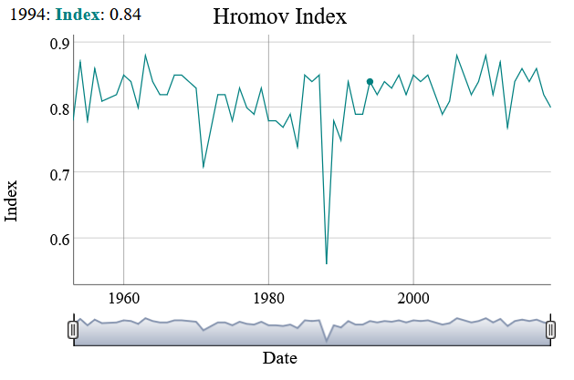

[](https://packagist.org/packages/soandso/continental-index)
[](https://packagist.org/packages/soandso/continental-index)

[](https://packagist.org/packages/soandso/continental-index)


Continental index
========================================

PHP library for calculating the index of continentality - a numerical characteristic of continental climate.




Requirements
-----------

This library only requires PHP >= 7.4

Setup
-----

Add the library to your composer.json file in your project:

```bash
{
  "require": {
      "soandso/continental-index": "0.*"
  }
}
```

Use [composer](http://getcomposer.org) to install the library:

```bash
$ php composer.phar install
```

Composer will install synop decoder library inside your vendor folder. Then you can add the following to your
.php files to use the library with Autoloading.

```php
require_once(__DIR__ . '/vendor/autoload.php');
```

You can also use composer on the command line to require and install Grouping:

```bash
$ php composer.phar require soandso/continental-index
```

Usage
-----

Instantiate the ```Register``` class with initialization data.

```php
require_once dirname(__FILE__) . '/vendor/autoload.php';

use Soandso\ContinentalIndex\Register;

$report = new Register($inputType, $source, $inputTempUnits, $outputTempUnits, $latitude);

$inputType - Supported types of source data:
Register::FILE
Register::ARRAY
Register::JSON

$source - Input source:
1. File (Show file path)
Source data structure:
Year, space, temperature amplitude value
Example:
2022 78.5

2. array:
[
  Year, temperature amplitude value
]
Example:
[
  [2017, 80.9],
  [2018, 70.3],
  ............
]

3. json:
This format is an array (see above) encoded into a json string

$inputTempUnits - Input temperature amplitude units:
Register::FAHRENHEIT
Register::CELSIUS

$outputTempUnits - Output temperature amplitude units:
Register::FAHRENHEIT
Register::CELSIUS

$latitude - Location latitude

```

To get the calculation of the continentality index, use the method ```getIndex```

```php

$index->getIndex(string $title, string $format, string $filePath = null);

$title - Type index of continentality
The following methods for calculating the continentality index are supported:

1. Hromov continentality index - Register::HROMOV_INDEX
2. Gorchinsky continentality index - Register::GORCHINSKY_INDEX
3. Conrad continentality index - Register::CONRAD_INDEX
4. Zenker continentality index - Register::ZENKER_INDEX


$format - Output format
Register::FILE
Register::ARRAY
Register::JSON

$filePath - The path to the directory for extracting the results file

```

**Plotting**

You can build a line graph of continentality index versus time for a given location.
To do this, you need to use the ```plot()``` method of the ```Register``` class, passing it the calculated data that were obtained using ```getIndex``` (see above)

```php Register::plot($indexAssets)```

The ```plot``` method also takes as its second optional argument options for plotting.

```php Register::plot($indexAssets, $options)```

```php
$options = [
/** Show or hide the range selector widget (Only for Dygraph provider) **/
'showRangeSelector'      => null, //true or false
/** Height, in pixels, of the range selector widget (Only for Dygraph provider) **/
'rangeSelectorHeight'    => null, //int
/** Width, in pixels, of the chart **/
'width'                  => null, //int
/** Height, in pixels, of the chart **/
'height'                 => null, //int
'title'                  => 'Continental index',
/** Text to display to the left of the chart's y-axis **/
'ylabel'                 => 'Index', //string
/** Text to display below the chart's x-axis **/
'xlabel'                 => 'Date', //string
];
```

**Example usage**

Index calculation
```php
$index = new Register(Register::FILE, __DIR__ . '/amplitude.txt', Register::FAHRENHEIT, Register::CELSIUS, 45.5);
$indexAssets = $index->getIndex(Register::HROMOV_INDEX, Register::FILE, __DIR__);
```

Plotting

```php
Register::plot($indexAssets);
```

Specifying Custom Graph Options

```php
Register::plot($indexAssets, [
        'showRangeSelector' => true,
        'rangeSelectorHeight' => 30,
        'title' => 'Hromov Index',
]);
```

Credits
-------

Dygraphs - open source JavaScript charting library. (https://dygraphs.com)


Standards
---------

Continental index conforms to the following standards:

* PSR-2  - Basic coding standard (https://www.php-fig.org/psr/psr-2/)
* PSR-4  - Autoloader (https://www.php-fig.org/psr/psr-4/)
* PSR-12 - Extended coding style guide (https://www.php-fig.org/psr/psr-12/)

License
-------

Grouping is licensed under the GPLv2 License (https://www.gnu.org/licenses/old-licenses/gpl-2.0.html).